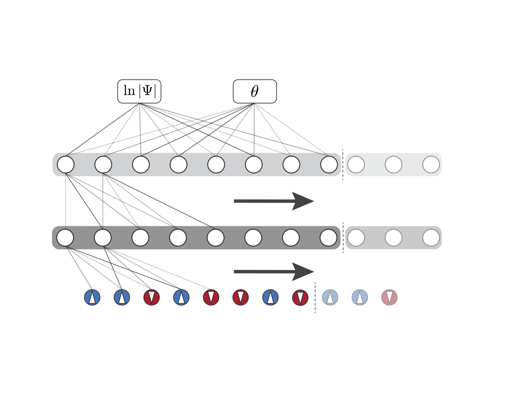
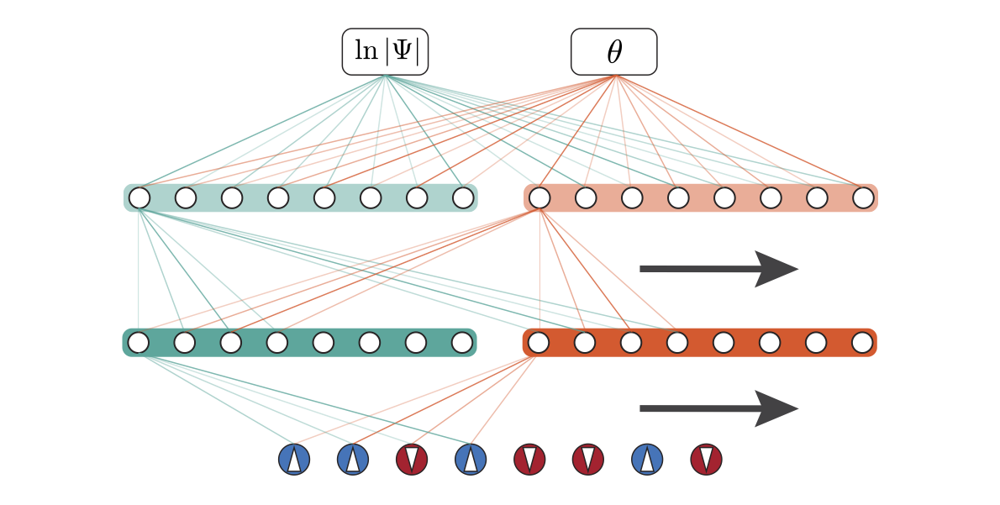

# Variational Monte Carlo with Proximal Policy Optimization
[toc]

## Requirement
    pyTorch >= 1.8.0 + cu111 

## Neural-network quantum state (NQS)
    algos.core
Two types of convolution neural network are implemented as NQS.
**Inputs**: spin configurations.
**Outputs**: 

* pesudocomplex CNN with only real parameters.

* complex CNN contains two sublayers in each layer, one stands for real part and the other denotes the imag part of the complex layer.

## Optimization: Natural gradient descent
Optimization object,

where  is the energy estimated via importance sampling and  is the Fubini-Study distance.

### PPO algorthim 
    algos.pesudocomplex_ppo or algos.complex_ppo
NGD can be approximately solved by PPO-clip and PPO-clip updates wavefunctions via,

with the loss function,

where   is estimated by the current wavefunction   and   is estimated by the old wavefunction  .

### Stochastic reconfiguration (TDVP)
    algos.pesudocomplex_sr or algos.complex_sr
The optimization object of NGD is also equivalent to,

due to,

where  is the stochastic reconfiguration matrix and .
Such a contitional minimal problem is hence equivalent to:

with a Lagrange multiplier . Its minimal satisfies,

which is the exact TDVP equation.

